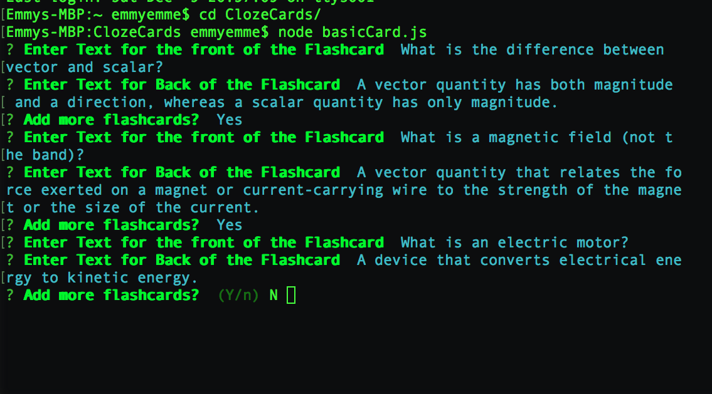

# ClozeCards

A node app that generates flashcards in the CLI via basic constructors and cloze constructors. Upon completion of the user's flashcards, the program writes and saves both sides of the cards to their respective .txt files for reuse.

